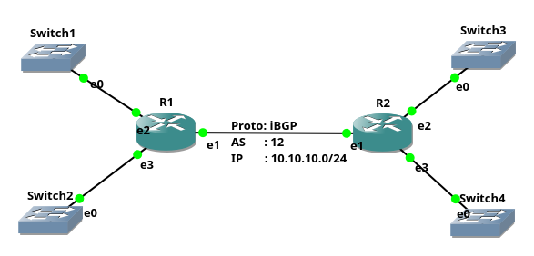

# Konfigurasi iBGP di Mikrotik



Tahapan Konfigurasi :
1. Set Identity Router
2. Add IP Address
3. Set BGP Instance
4. Add BGP Peer

R1
```sh
# Konfigurasi set identity router nya di R1:
[admin@Mikrotik] > /system identity set name=R1
[admin@R1] > 
# Konfigurasi menambahkan IP Address di Mikrotik R1 :
[admin@R1] > /ip address
add address=10.10.10.1/24 interface=ether2 network=10.10.10.0
add address=192.168.0.1/24 interface=ether3 network=192.168.0.0
add address=192.168.1.1/24 interface=ether4 network=192.168.1.0 
# Konfigurasi set BGP Instance di Mikrotik R1 :
[admin@R1] > /routing bgp instance set default as=12  
# Konfigurasi BGP Peering di Mikrotik ke remote AS yang sama (iBGP Peering) di R1:
[admin@R1] > /routing bgp peer add name=peer-to-R2 remote-address=10.10.10.2 remote-as=12
```

R2
```sh
# Konfigurasi di R2 tahapan nya sama seperti yang kita lakukan di R1 :
[admin@Mikrotik] > /system identity set name=R2
[admin@R2] >
[admin@R2] > /ip address
add address=10.10.10.2/24 interface=ether2 network=10.10.10.0
add address=192.168.2.1/24 interface=ether3 network=192.168.2.0
add address=192.168.3.1/24 interface=ether4 network=192.168.3.0
[admin@R2] > /routing bgp instance set default as=12 
[admin@R2] > /routing bgp peer
add name=peer-to-R1 remote-address=10.10.10.1 remote-as=12
```

verifikasi konfigurasi:
```sh
# R1
[admin@R1] > /ip address print
Flags: X - disabled, I - invalid, D - dynamic 
 #   ADDRESS            NETWORK         INTERFACE                              
 0   10.10.10.1/24      10.10.10.0      ether2                                 
 1   192.168.0.1/24     192.168.0.0     ether3                                 
 2   192.168.1.1/24     192.168.1.0     ether4 
[admin@R-1] >
[admin@R-1] > /routing bgp peer print status
Flags: X - disabled, E - established
 0 E name="peer-to-R2" instance=default remote-address=10.10.10.2 remote-as=12 tcp-md5-key=""
     nexthop-choice=default multihop=no route-reflect=no hold-time=3m ttl=255 in-filter="" out-filter=""
     address-families=ip default-originate=never remove-private-as=no as-override=no passive=no use-bfd=no
     remote-id=192.168.2.1 local-address=10.10.10.1 uptime=4m42s prefix-count=0 updates-sent=0
     updates-received=0 withdrawn-sent=0 withdrawn-received=0 remote-hold-time=3m used-hold-time=3m
     used-keepalive-time=1m refresh-capability=yes as4-capability=yes state=established
[admin@R-1] >

# R2 sama pada pengecekan R1
[admin@R2] > /ip address print
Flags: X - disabled, I - invalid, D - dynamic 
 #   ADDRESS            NETWORK         INTERFACE                              
 0   10.10.10.2/24      10.10.10.0      ether2                                 
 1   192.168.2.1/24     192.168.2.0     ether3                                 
 2   192.168.3.1/24     192.168.3.0     ether4  
[admin@R-2] >
[admin@R-2] > /routing bgp peer print status
Flags: X - disabled, E - established
 0 E name="peer-to-R1" instance=default remote-address=10.10.10.1 remote-as=12 tcp-md5-key=""
     nexthop-choice=default multihop=no route-reflect=no hold-time=3m ttl=255 in-filter="" out-filter=""
     address-families=ip default-originate=never remove-private-as=no as-override=no passive=no use-bfd=no
     remote-id=10.10.10.1 local-address=10.10.10.2 uptime=5m38s prefix-count=0 updates-sent=0
     updates-received=0 withdrawn-sent=0 withdrawn-received=0 remote-hold-time=3m used-hold-time=3m
     used-keepalive-time=1m refresh-capability=yes as4-capability=yes state=established
[admin@R-2] >
```

Ternyata sudah berhasil peering satu sama lain di AS yang sama.

Melakukan advertising network ke dalam iBGP, supaya kedua router bisa saling mengetahui keberadaan network dibelakang nya.

Konfigurasi advertising network BGP pada Mikrotik : 
```sh
[admin@R-1] > /routing bgp network 
add network=192.168.0.0/24
add network=192.168.1.0/24
[admin@R-2] > /routing bgp network
add network=192.168.2.0/24
add network=192.168.3.0/24
```
Sekarang pengecekan lagi, pengecekan apakah advertise network tetang sudah masuk ke dalam routing tabel atau belum.
```sh 
[admin@R1] > /ip route print detail
Flags: X - disabled, A - active, D - dynamic, 
C - connect, S - static, r - rip, b - bgp, o - ospf, m - mme, 
B - blackhole, U - unreachable, P - prohibit 
 0 ADC  dst-address=10.10.10.0/24 pref-src=10.10.10.1 gateway=ether2 
        gateway-status=ether2 reachable distance=0 scope=10 

 1 ADC  dst-address=192.168.0.0/24 pref-src=192.168.0.1 gateway=ether3 
        gateway-status=ether3 reachable distance=0 scope=10 

 2 ADC  dst-address=192.168.1.0/24 pref-src=192.168.1.1 gateway=ether4 
        gateway-status=ether4 reachable distance=0 scope=10 

 3 ADb  dst-address=192.168.2.0/24 gateway=10.10.10.2 
        gateway-status=10.10.10.2 reachable via  ether2 distance=200 scope=40 
        target-scope=30 bgp-local-pref=100 bgp-origin=igp 
        received-from=peer-to-R2 

 4 ADb  dst-address=192.168.3.0/24 gateway=10.10.10.2 
        gateway-status=10.10.10.2 reachable via  ether2 distance=200 scope=40 
        target-scope=30 bgp-local-pref=100 bgp-origin=igp 
        received-from=peer-to-R2 
[admin@R1] >
```

```sh 
[admin@R2] > /ip route print detail
Flags: X - disabled, A - active, D - dynamic, 
C - connect, S - static, r - rip, b - bgp, o - ospf, m - mme, 
B - blackhole, U - unreachable, P - prohibit 
 0 ADC  dst-address=10.10.10.0/24 pref-src=10.10.10.2 gateway=ether2 
        gateway-status=ether2 reachable distance=0 scope=10 

 1 ADb  dst-address=192.168.0.0/24 gateway=10.10.10.1 
        gateway-status=10.10.10.1 reachable via  ether2 distance=200 scope=40 
        target-scope=30 bgp-local-pref=100 bgp-origin=igp 
        received-from=peer-to-R1 

 2 ADb  dst-address=192.168.1.0/24 gateway=10.10.10.1 
        gateway-status=10.10.10.1 reachable via  ether2 distance=200 scope=40 
        target-scope=30 bgp-local-pref=100 bgp-origin=igp 
        received-from=peer-to-R1 

 3 ADC  dst-address=192.168.2.0/24 pref-src=192.168.2.1 gateway=ether3 
        gateway-status=ether3 reachable distance=0 scope=10 

 4 ADC  dst-address=192.168.3.0/24 pref-src=192.168.3.1 gateway=ether4 
        gateway-status=ether4 reachable distance=0 scope=10 
[admin@R2] >
```